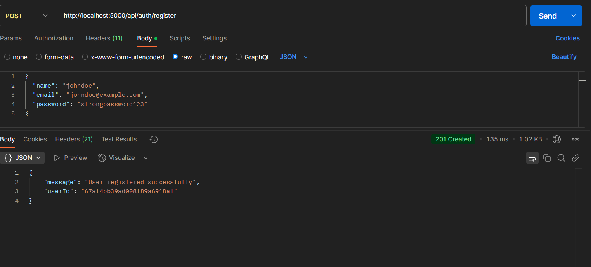
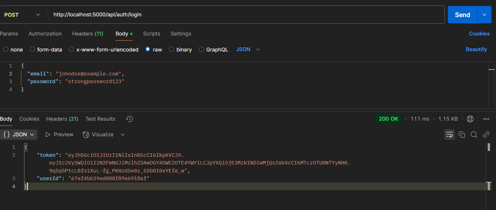
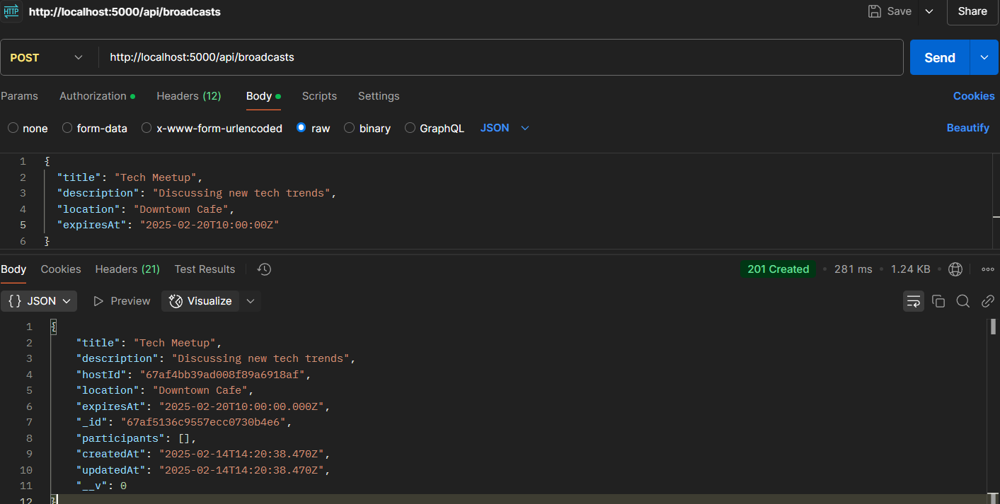
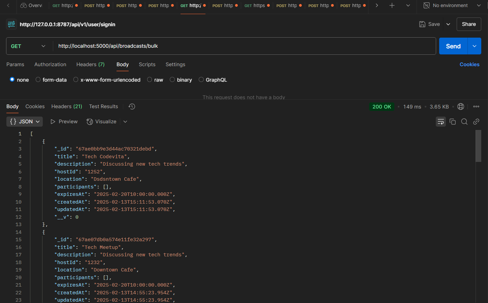
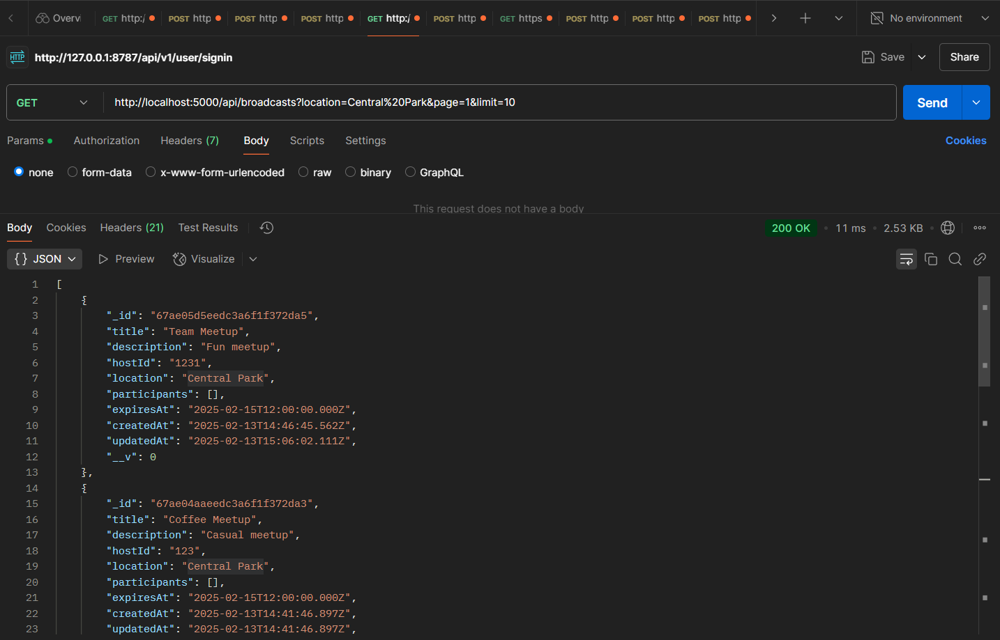
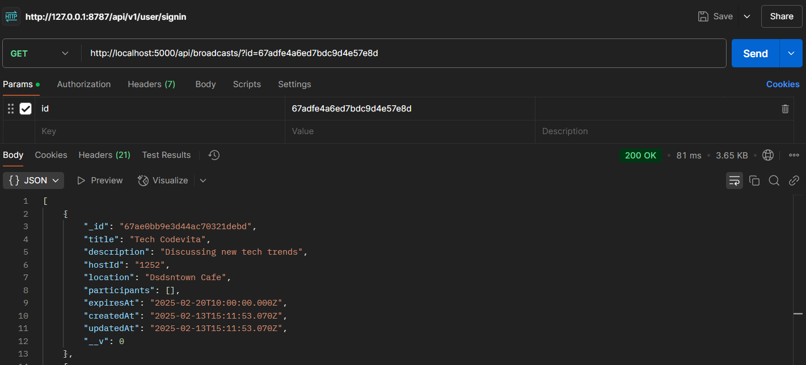
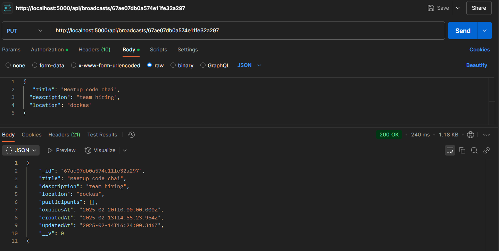
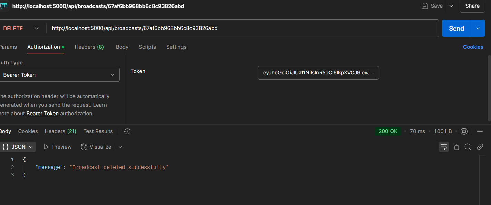
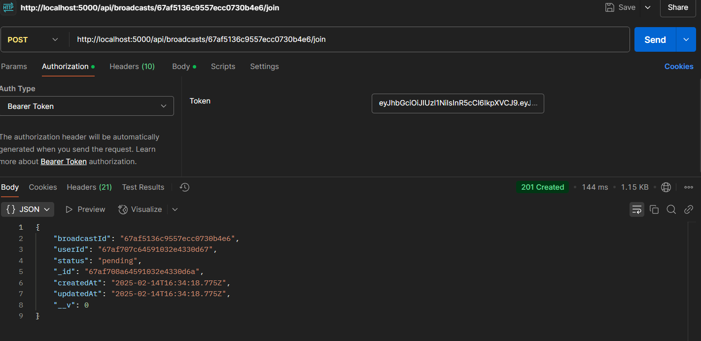

# Spontaneous Meetup Broadcast API 🚀

## 📌 Overview
A scalable backend system for broadcasting spontaneous meetups.  
Built with **Node.js, Express, MongoDB, Redis, and TypeScript**.

## 🛠️ Tech Stack
- **Backend**: Node.js, Express.js, TypeScript
- **Database**: MongoDB (NoSQL)
- **Caching**: Redis
- **Queue Handling**: BullMQ
- **Testing**: Jest, Supertest
- **CI/CD**: GitHub Actions, Docker

---

## 🚀 Getting Started

### 1️ Install Dependencies
```sh
npm install
```

### 2️ Setup Environment Variables  
Create a `.env` file and add:
```
PORT=5000
MONGO_URI=mongodb://localhost:27017/meetup
REDIS_URL=redis://localhost:6379
```

### 3️ Run Locally  
```sh
npm run dev
```

### 4️ Run Tests
```sh
npm test
```

---

## 📖 API Documentation  
Access Swagger UI: [http://localhost:5000/api-docs](http://localhost:5000/api-docs)


### ✅ Sample Endpoints:

#### **Get Register**
```http
POST /api/auth/register
```

**Body:**
```json
{
  "name":"john",
 "email":"john@eample",
 "password" : "122279"

}
```

**Response:**


#### **Get Login**
```http
POST /api/auth/login
```
**Body:**
```json
{
  
 "email":"john@eample",
 "password" : "122279"

}
```

**Response:**


### **Create Broadcast**
```http
POST /api/broadcasts
```
**Body:**
```json
{
  "title": "Tech Meetup",
  "description": "Discussing AI",
  "hostId": "12334",
  "location": "Downtown Cafe",
  "expiresAt": "2025-02-20T15:00:00Z"
}
```
**Response:**


---

### **Get Active Broadcasts**
```http
GET /api/broadcasts/bulk
```
**Response:**


---

### **Search Broadcasts**
```http
GET /api/broadcasts
```
**Query Parameters:**
- `search` (string): Search by title, description, or location.
- `sortBy` (string): Sort by `createdAt`, `expiresAt`, or `popularity`.
- `order` (string): Sorting order (`asc` or `desc`).
- `location` (string): Filter by location.
- `hostId` (string): Filter by host ID.
- `page` (integer, default: 1): Page number for pagination.
- `limit` (integer, default: 10): Number of results per page.

**Response:**


---

### **Get Broadcast by ID**
```http
GET /api/broadcasts/{id}
```
**Response:**


---

### **Update Broadcast**
```http
PUT /api/broadcasts/{id}
```
**Body:**
```json
{
  "title": "Updated Tech Meetup",
  "description": "Discussing latest AI trends",
  "location": "Uptown Cafe"
}
```
**Response:**



---

### **Delete Broadcast**
```http
DELETE /api/broadcasts/{id}
```
**Response:**



---

### **Join Broadcast**
```http
POST /api/broadcasts/{id}/join
```
**Response:**


---

### **Approve or Reject Join Request**
```http
PATCH /api/broadcasts/{broadcastId}/join/{userId}
```
**Body:**
```json
{
  "status": "approved"
}
```
**Response:**
```json
{
  "message": "Join request status updated successfully"
}
```

---

## **Authentication & Security**
Most endpoints require authentication using a Bearer Token. Include the token in the `Authorization` header:
```http
Authorization: Bearer <your_token>
```

---

## **Error Handling**
- `400 Bad Request`: Invalid input or missing parameters.
- `401 Unauthorized`: Missing or invalid authentication token.
- `403 Forbidden`: User does not have permission.
- `404 Not Found`: Requested resource does not exist.
- `500 Internal Server Error`: Unexpected server error.

---

## ⚙️ CI/CD & Deployment
### **Automated GitHub Actions**
- Runs tests on every push.
- Deploys to production on **main** branch.


## 🤝 Contributing
1. Fork the repository.
2. Create a feature branch: `git checkout -b feature-name`
3. Commit changes: `git commit -m "Add new feature"`
4. Push: `git push origin feature-name`
5. Open a **Pull Request** 🎉


## **License**
This API is open-source and available under the MIT License.

### Thank YOU